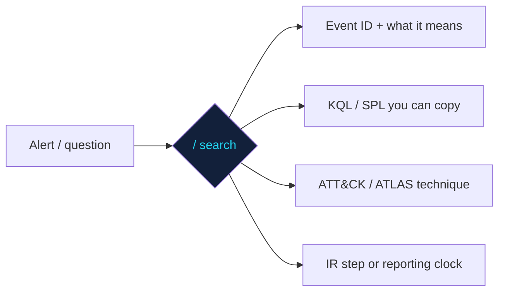

<div align="center">

# 🧭 SOC Field Manual

### The things a SOC analyst reaches for mid-incident — in one page that searches instantly.

[](https://cdxdebian.github.io/SOC-Field-Manual/)
<br/>


**👉 [cdxdebian.github.io/SOC-Field-Manual](https://cdxdebian.github.io/SOC-Field-Manual/)**

</div>

---

A fast, offline, zero-dependency reference for security operations. Press <kbd>/</kbd> and type — results filter and highlight as you go, and every query has a one-click **copy** button.

### What's in it

| Category | Covers |
|---|---|
| **Windows event IDs** | 4624/4625 logons · 4688 process creation · 4719 audit-policy change · 4768/4769 Kerberos · 4662 DCSync · 1102 log cleared · Sysmon essentials |
| **KQL** (Sentinel / Defender) | Kerberoasting · impossible travel · rare-process stack counting · LSASS access · DNS tunnelling · log-source silence · FP-rate-per-rule |
| **SPL** (Splunk) | Outbound exfil by user · silent log sources · new local admin |
| **MITRE ATT&CK + AI** | Tactic order · phishing · PowerShell · lateral movement · ransomware · Pyramid of Pain · OWASP LLM Top 10 · MITRE ATLAS agentic techniques |
| **IR & RCA** | NIST 800-61 lifecycle · order of volatility · first 5 minutes on an alert · severity model · isolate-vs-observe · root-cause discipline |
| **Regulatory (India)** | CERT-In 6-hour clock · 180-day retention · SEBI CSCRF · ISO 27001 SOC controls · NIST CSF 2.0 |

### Why it exists

Every analyst keeps a messy notes file of event IDs and queries. This is that file, made searchable, kept accurate, and framed the way detection actually works — **each entry says where the detection lives, not just what the technique is.** Fork it, add your environment's queries, and make it your team's.



### Run it

```bash
git clone https://github.com/CdxDebian/soc-field-manual
cd soc-field-manual && python -m http.server 8000   # http://localhost:8000
```
Single `index.html`, no build step. Works offline — open the file directly.

### Enable the live page (GitHub Pages)
Settings → Pages → Source: **Deploy from a branch** → `main` / `root`.

> ⚠️ Queries are **starting points** — adjust table names, field names and thresholds to your environment, and validate with a simulation before production. Not a substitute for your own detection engineering.

---

<div align="center">
<sub>Curated by <b>Rahul Shrivastava</b> — Security Operations Engineer</sub><br/>
<a href="https://www.rahulshrivastava.co.in">Website</a> · <a href="https://www.linkedin.com/in/shriv-rahul/">LinkedIn</a> · <a href="https://github.com/CdxDebian">GitHub</a> · <a href="https://github.com/CdxDebian/IR-Playbooks">IR-Playbooks</a>
</div>
